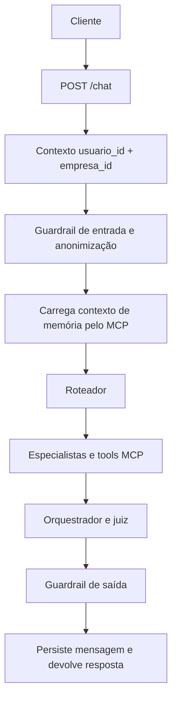

# Arquitetura do ACTA AI

## Responsabilidades

O ACTA AI é a camada conversacional. Ele não consulta bancos de dados diretamente;
chama tools publicadas pelo MCP e usa os resultados estruturados para construir a
resposta. O MCP é responsável por autorização, isolamento de tenant, acesso aos
dados e persistência de memória.

| Componente | Responsabilidade |
| --- | --- |
| `main.py` | API FastAPI, validação dos contratos HTTP e contexto da requisição. |
| `pipeline.py` | Grafo LangGraph e histórico em memória de processo por sessão. |
| `agents/estado.py` | Nós do fluxo, roteamento, especialistas, memória e avaliação. |
| `agents/guardrail.py` | Anonimização de PII e bloqueios de segurança. |
| `clients/mcp_acta_client.py` | Cliente Streamable HTTP, cabeçalhos de identidade, tentativas e cache por execução. |
| `clients/memory_client.py` | Fachada das tools de memória do MCP. |

## Fluxo de uma mensagem

O roteador seleciona os especialistas de acordo com a intenção. Especialistas usam
as tools do MCP para ciclos, tarefas, colaboradores, formulários, predições, RAG,
lições aprendidas e outros domínios. A resposta final passa por revisão antes de
voltar ao cliente.

## Identidade e isolamento

Cada rota que acessa o MCP instala um `mcp_request_context` com `usuario_id`,
`empresa_id` e um `trace_id`. O cliente MCP envia esses valores em cabeçalhos; eles
não são argumentos disponíveis ao modelo. O servidor MCP decide as permissões e
aplica os filtros de tenant.

O cache de tools dura somente uma execução da pipeline. O estado do LangGraph usa
uma chave que inclui empresa, usuário e `session_id`, evitando misturar históricos
locais de sessões de tenants diferentes.

## Histórico local e memória persistente

O `MemorySaver` do LangGraph conserva mensagens enquanto o processo está vivo.
Ele melhora a continuidade da rodada, mas não é a fonte persistente. A memória
durável está no MCP: MongoDB é a fonte oficial e Qdrant é o índice semântico.
Consulte [Memória](memoria.md) para o ciclo completo.

## Observabilidade

Quando habilitada pelas variáveis `ACTA_OBSERVABILITY_*`, a API instrumenta o
FastAPI e registra spans para chat, pipeline e chamadas MCP. As chaves de telemetria
devem ficar somente no `.env` ou no gerenciador de segredos da plataforma.
