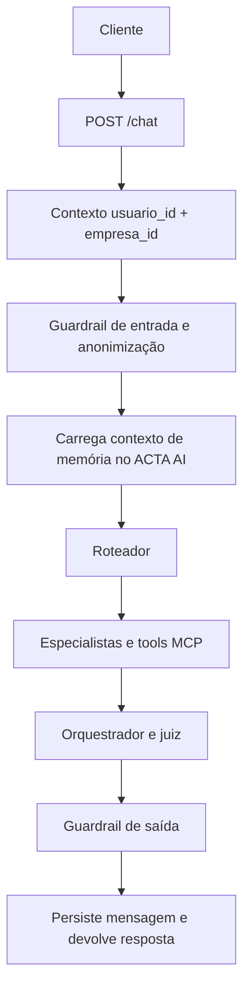

# Arquitetura do ACTA AI

## Responsabilidades

O ACTA AI é a camada conversacional e mantém suas capacidades internas: memória e
skills pessoais. Para dados, FAQ e operações dos domínios ACTA, chama tools
publicadas pelo MCP, que aplica autorização e isolamento de tenant.

| Componente | Responsabilidade |
| --- | --- |
| `main.py` | API FastAPI, validação dos contratos HTTP e contexto da requisição. |
| `pipeline.py` | Grafo LangGraph e histórico em memória de processo por sessão. |
| `agents/estado.py` | Nós do fluxo, roteamento, especialistas, memória e avaliação. |
| `agents/guardrail.py` | Anonimização de PII e bloqueios de segurança. |
| `clients/mcp_acta_client.py` | Cliente Streamable HTTP para operações de domínio. |
| `clients/memory_client.py` | Operações de memória no MongoDB/Qdrant do ACTA AI. |
| `clients/skill_client.py` | Skills pessoais no MongoDB do ACTA AI. |
| `utils/` | Repositórios e serviços internos do chatbot. |

## Fluxo de uma mensagem

O roteador seleciona os especialistas de acordo com a intenção. Especialistas usam
tools do MCP para dados de ciclos, tarefas, colaboradores, formulários, predições e
lições aprendidas e FAQ. O FAQ/RAG usa a base documental publicada pelo MCP. A resposta final passa
por revisão antes de voltar ao cliente.

## Identidade e isolamento

Cada rota autenticada instala um `mcp_request_context` com `usuario_id`, `empresa_id`
e um `trace_id`. O contexto filtra memória/skills no ACTA AI e vai em cabeçalhos nas
chamadas MCP; a identidade não fica disponível como argumento do modelo.

O cache de tools dura somente uma execução da pipeline. O estado do LangGraph usa
uma chave que inclui empresa, usuário e `session_id`, evitando misturar históricos
locais de sessões de tenants diferentes.

## Histórico local e memória persistente

O `MemorySaver` do LangGraph conserva mensagens enquanto o processo está vivo.
Ele melhora a continuidade da rodada, mas não é a fonte persistente. A memória
durável fica no ACTA AI: MongoDB é a fonte oficial e Qdrant, quando configurado, é o
índice semântico.
Consulte [Memória](memoria.md) para o ciclo completo.

## Observabilidade

Quando habilitada pelas variáveis `ACTA_OBSERVABILITY_*`, a API instrumenta o
FastAPI e registra spans para chat, pipeline e chamadas MCP. As chaves de telemetria
devem ficar somente no `.env` ou no gerenciador de segredos da plataforma.
